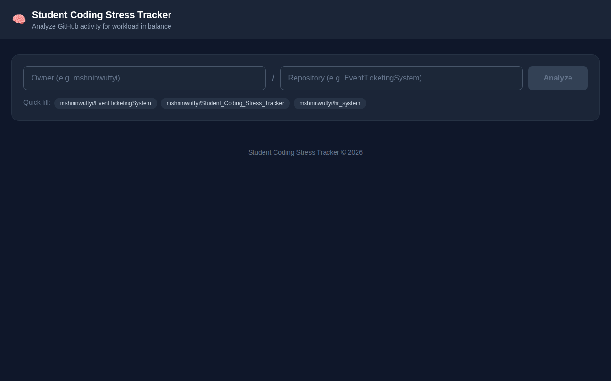
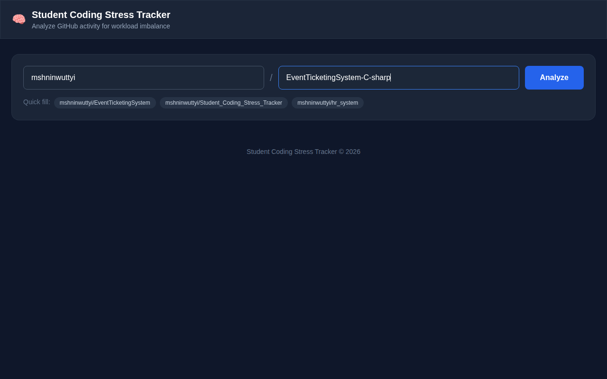
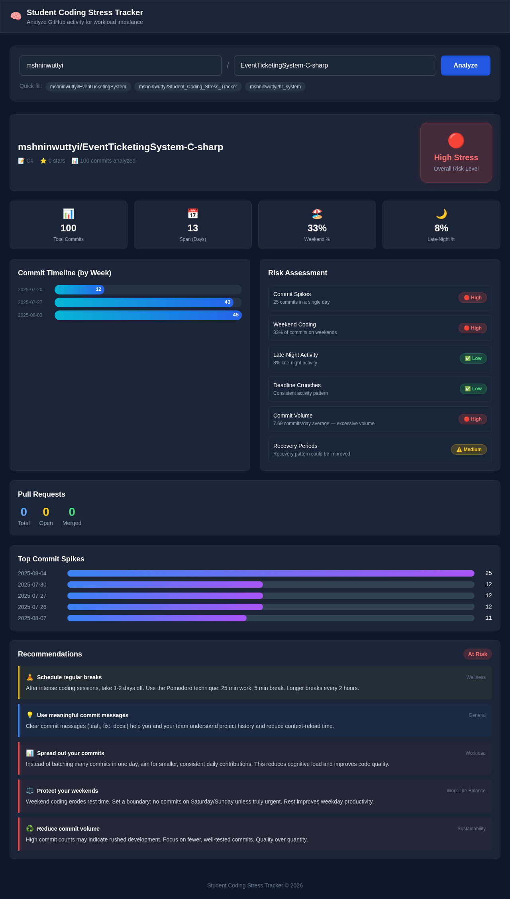

# Student Coding Stress Tracker

A web application that analyzes GitHub repository activity to detect coding workload imbalance and stress patterns in student developers. By examining commit history, coding habits, and repository metrics, it provides actionable wellness recommendations to promote healthier development practices.

## Screenshots

### Start Page


### Before Analysis


### After Analysis


## Features

- **GitHub Repository Search** — Enter any public GitHub repository (owner/repo) to begin analysis
- **Commit Activity Analysis** — Visualizes commit patterns over time with an interactive chart
- **Stress Level Gauge** — Displays a stress score based on coding behavior metrics
- **Risk Matrix** — Evaluates workload imbalance across multiple dimensions
- **Coding Habit Insights** — Analyzes late-night commits, weekend work, and commit frequency spikes
- **Wellness Recommendations** — Provides personalized suggestions to reduce burnout and improve work-life balance
- **Dark Themed Dashboard** — Clean, modern glass-morphism UI for comfortable viewing

## Tech Stack

| Layer      | Technology                          |
|------------|-------------------------------------|
| Frontend   | React 19, Tailwind CSS 3, Vite 6    |
| Backend    | Node.js, Express 5                  |
| Data       | GitHub API via Octokit              |
| Tooling    | Puppeteer, Concurrently, PostCSS    |

## Getting Started

### Prerequisites

- Node.js 18+
- A GitHub Personal Access Token (for API rate limits)

### Installation

```bash
# Install all dependencies
npm run install:all
```

### Configuration

Create a `.env` file in the `server/` directory:

```
GITHUB_TOKEN=your_github_personal_access_token
```

### Running the App

```bash
# Start both client and server concurrently
npm run dev
```

The client runs at `http://localhost:5173` and the server at `http://localhost:3000`.

## Project Structure

```
Student_Coding_Stress_Tracker/
├── client/                  # React frontend
│   └── src/
│       ├── components/
│       │   ├── RepoSearch.jsx      # Repository search input
│       │   ├── Dashboard.jsx       # Main results layout
│       │   ├── CommitChart.jsx     # Commit activity visualization
│       │   ├── StressGauge.jsx     # Stress level indicator
│       │   ├── RiskMatrix.jsx      # Workload risk assessment
│       │   └── Recommendations.jsx # Wellness suggestions
│       └── App.jsx
├── server/                  # Express backend
│   ├── routes/
│   │   └── analysis.js      # API endpoint for repo analysis
│   └── services/
│       ├── github.js         # GitHub API integration
│       ├── coding-analyzer.js# Commit pattern analysis
│       ├── stress-analyzer.js# Stress score calculation
│       └── wellness.js       # Recommendation engine
└── screenshots/             # App screenshots
```

## License

MIT
